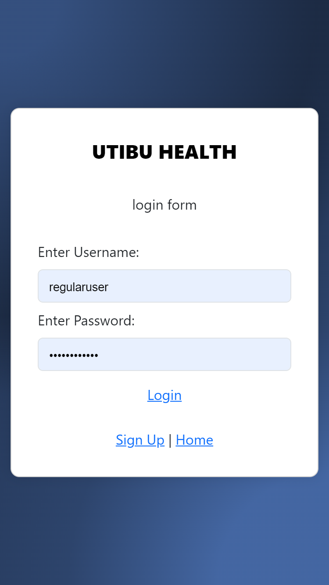
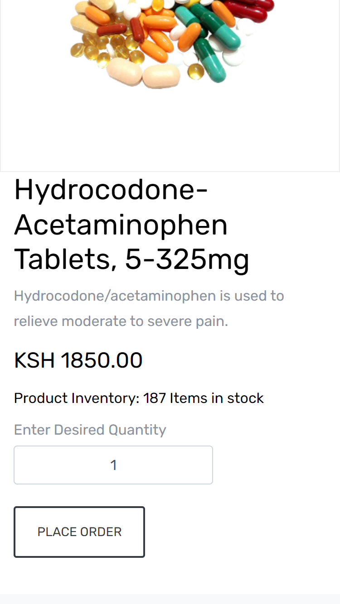
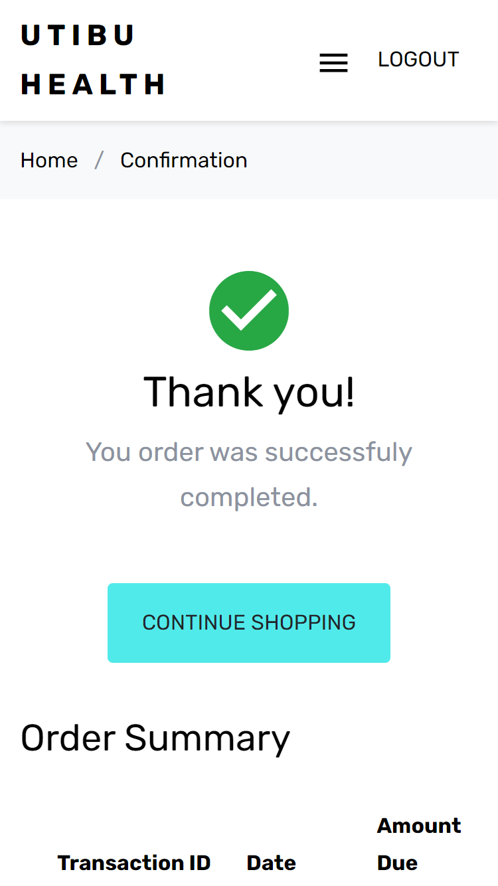
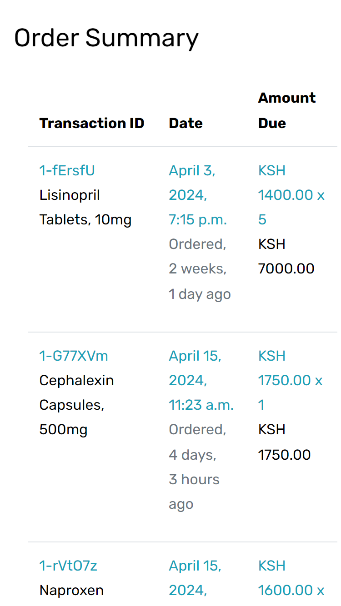
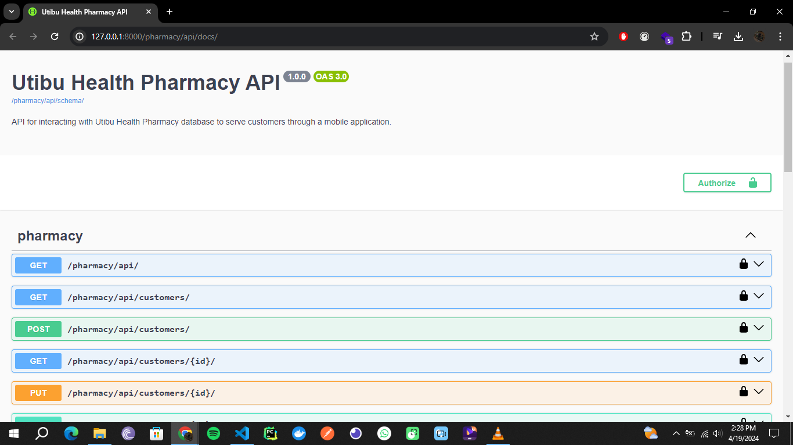

# Utibu Health Pharmacy API & Web Application

## Overview
This project is a Django application that serves as a REST API for Utibu Health Pharmacy. It allows registered customers to make orders for medication remotely from a mobile app and check their statement.

In addition to the RESTful API, this project includes a web application with templates for each view to serve the client. You can access the web application by navigating to `http://127.0.0.1:8000/pharmacy` in your web browser.

## Installation
1. Clone the repository.
2. Create a virtual env `python3 -m venv venv`
3. Activate the venv `venv\Scripts\activate`
4. Install dependencies: `pip install -r requirements.txt`.
5. Make database migrations: `python manage.py makemigrations`.
6. Set up the database: `python manage.py migrate`.
7. Create superuser: `python manage.py createsuperuser`.
8. Run the development server: `python manage.py runserver`

## Usage
1. API Endpoints: [API Documentation](./pharmacy/api/README.md)

## Screens

### Mobile Application

### API Documentation

